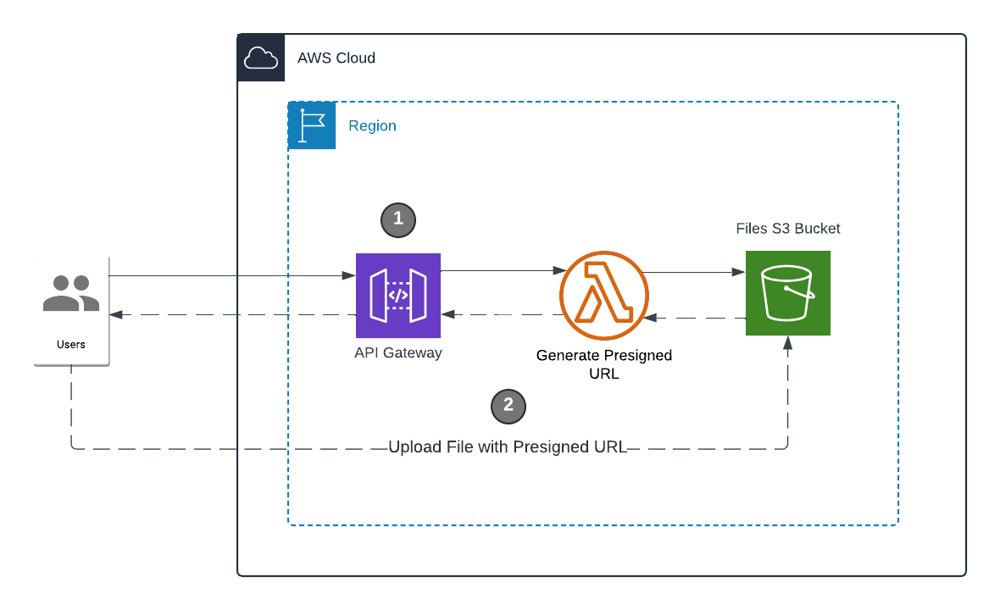

# AWS CDK Serverless S3 File Manager

Securely manage and upload files with dynamic CORS configuration, powered by AWS services and adhering to the least privilege principle.

<p align="center">
  <a href="https://d3e6uqkvaffypm.cloudfront.net/" target="_blank">Live Demo</a>
</p>
                  


## Quick Start

### AWS Account Permissions

Ensure the AWS account you're using has the necessary permissions to access and manage the required services. This includes permissions for:

* S3
* Lambda
* API Gateway
* CloudFormation
* IAM
* Systems Manager (SSM)
* Elastic Container Registry (ECR)
* Simple Notification Service (SNS)
* Simple Queue Service (SQS)
* CloudFront

To configure the AWS account with the necessary permissions, use the AWS Management Console or AWS CLI to attach the appropriate policies to your user or role. 

It is recommended to create a custom policy with the least privilege principle.

You can use AWS-managed policies such as `AdministratorAccess` for full permissions to start, and debug permssion related issues.

With the correct setup, you'll have your full stack serverless app up and running in minutes!

### Deployment Options

There are two ways to deploy this application:

1. **Deploy Using GitHub Actions**: This method requires no prerequisite installations other than a GitHub account. It handles deployment automatically through GitHub Actions.

2. **Run Locally**: Requires certain prerequisites to be installed locally.

### 1. Deploy Using GitHub Actions

1. **Fork the Repository:**
   Fork this repository to your GitHub account.

2. **Add Secrets:**
   Add the required parameters to the secrets in your GitHub repository settings. Navigate to `Settings > Secrets > Actions` and add the following secrets:

   - `AWS_ACCESS_KEY_ID`
   - `AWS_SECRET_ACCESS_KEY`
   - `AWS_REGION`

3. **Push Changes:**
   Push any changes to your forked repository. This will trigger the GitHub Actions workflow to deploy your application.


### 2. Run Locally

#### Prerequisites
- Node.js (v20 or later)
- AWS CLI
- AWS CDK (v2)
- GitHub account

1. **Clone the Repository:**
   ```sh
   git clone https://github.com/your-username/AWS-S3-Secure-File-Manager-Starter.git
   cd AWS-S3-Secure-File-Manager-Starter
   ```

2. **Run deploy.sh in bash**
   ```
   ./deploy.sh
    ```
   

## Key Features

### **Dynamic CORS and Frontend Configuration**

* Automatically configures CORS settings and access policies at runtime, ensuring secure and seamless operation.

### **Secure File Operations**

* Uses presigned URLs for both uploads and downloads, ensuring that access to the private S3 bucket is tightly controlled. The bucket is not publicly accessible, and file operations are only permitted through these secure presigned URLs, adhering to the principle of least privilege.

### **Efficient and Scalable Architecture**

* Directly manages file operations through S3, bypassing Lambda to enhance performance and scalability while reducing costs.

### **Easy Integration**

* Seamlessly integrate into other applications by updating the frontend URL, with automated network configurations handled by the app.

## How It Works



1. **Generating Presigned URLs**:
   - Your backend generates presigned URLs using AWS SDKs. These URLs are temporary and scoped to specific S3 operations, akin to giving out temporary access passes.

2. **Client-Side Upload**:
   - The React frontend receives the presigned URL and uses it to upload files directly to S3 via HTTP PUT or POST requests.

3. **Security and Validation**:
   - AWS validates the presigned URL parameters, ensuring that only authorized uploads are accepted, like checking IDs before entry.

  ## Integration Possibilities:
  **Seamlessly incorporate into major platforms like:**
  
- **Content Management Systems (CMS)**: Perfect for handling media assets (e.g., WordPress).
- **E-Commerce Platforms**: Ideal for managing product images and customer reviews (e.g., Shopify).
- **Social Media Platforms**: Great for user-uploaded content such as photos and videos (e.g., Instagram).


## License

This project is licensed under the MIT License - see the [LICENSE](LICENSE) file for details.
